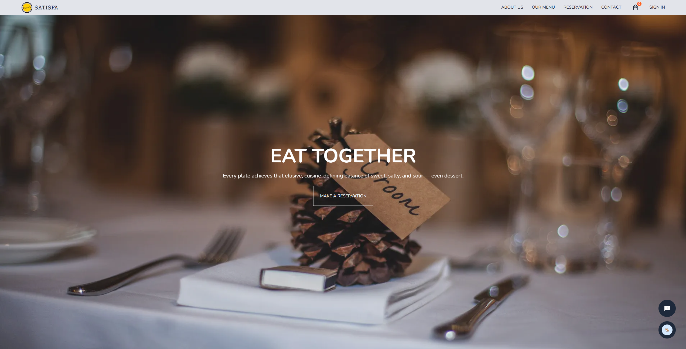

# Satisfa Restaurant
This website is a place to introduce about a restaurant named "Satisfa". This is the repo for landing page. Another repo for management side. Some features in the web such as:
- Introduce about restaurant
- Allow customer to make reservation
- Allow customer to place order and payment
- Allow customer to use chatbot to make reservation, make order, ask some frequently questions,...
- Chatbot can recommend food for customer
## Demo
Link: [Satisfa Restaurant](https://satisfa.vercel.app)  
Video: https://youtu.be/GEYMi61EPkU
## Main Technical Stack

## User Interface

## Team
- Thien Bao: [@bao-nguyenbku](https://github.com/bao-nguyenbku)  
- Minh Chau: [@kogleo](https://github.com/kogleo)
